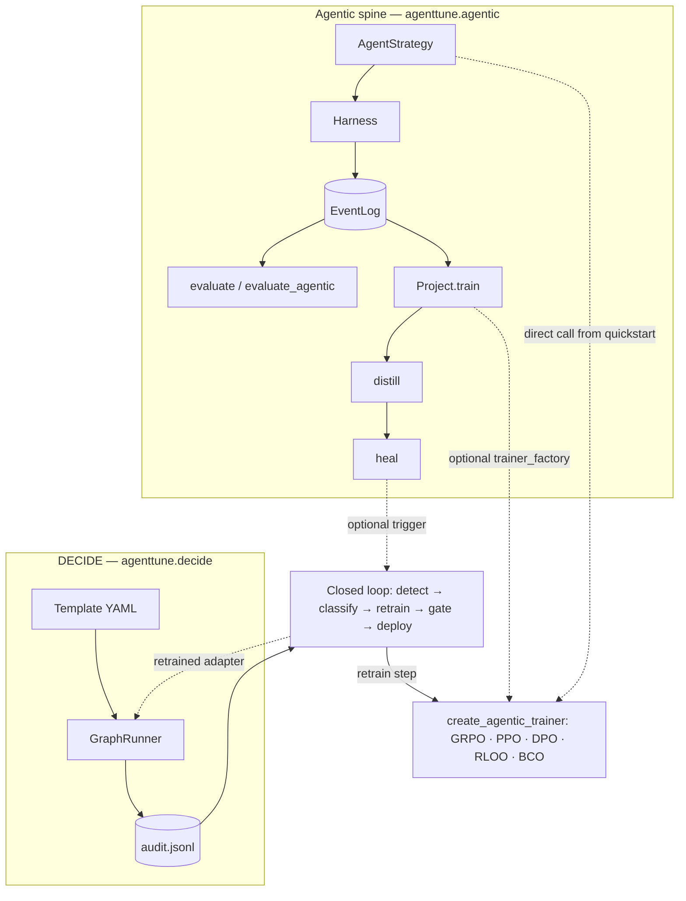

<p align="center">
  <picture>
    <source media="(prefers-color-scheme: dark)" srcset="docs/assets/agenttune-logo-on-dark.png">
    
  </picture>
</p>

<div align="center">
  <a href="https://www.python.org/downloads/"></a>
  <a href="LICENSE"></a>
  <a href="CHANGELOG.md#110---2026-09-28"></a>
  <a href="CHANGELOG.md"></a>
</div>

---

**AgentTune** has two parts. The first is an **RL trainer built on TRL** that runs GRPO, PPO, DPO, RLOO, and BCO through one entry point and trains LLM agents to call tools during rollouts. The second, layered on top, is the **agentic integration spine**, which moves one agent artifact through its lifecycle: **build → collect → evaluate → train → distill → heal**.

Most agent tooling covers running an agent design, a memory system, or a harness. AgentTune also trains, evaluates, distills, and self-heals that design, and every stage reads and writes **one normalized trajectory schema** (`EventLog`), so you don't need a separate tool per stage. It sits on top of whatever agent framework built the design.

## Core Features

**Agentic Spine**: One `EventLog` schema carries an agent artifact through `build → collect → evaluate → train → distill → heal`. Trajectories come in a light tier (observational) and a full tier (trainable, with token spans and logprobs), can be projected from a harness episode, a DECIDE pipeline run, or a bare eval trace, and are all scored the same way.

**RL Training**: Every `create_agentic_trainer(algorithm=...)` call runs on the TRL backend, for GRPO, PPO, DPO, RLOO, and BCO. All five use agentic tool-calling rollouts rather than plain-text generation.

**DECIDE, Decision Workflows as YAML**: A business-rule pipeline (`llm_call`, `router`, `llm_judge`, `rules`, `tool_call` stages) is defined as a YAML template. It compiles into a `langgraph` `StateGraph` with audit logging and step-limit enforcement.

**Self-Healing Closed Loop**: Detects a failing or looping agent, classifies the failure, and generates a corrective training example. The agent is retrained through the spine's trainers, and redeployment is gated on accuracy.

**Agentic RAG + Data Synthesis**: Trains a tool-using search agent end-to-end against a retrieval backend, or turns a raw document corpus into a difficulty-tagged, grounded multi-hop QA training set with a 6-stage synthesis pipeline.

**Verified runs and known issues**: The trained paths contain no mock code. Every algorithm and component has a GPU run with captured output and its caveats. The [Known Issues](docs/community/known-issues.md) page lists what is still rough, based on reading the source and running it.

### The pillars of the agentic spine

Additive capability layers, each speaking `EventLog`, each testable with no model and no GPU.

1. **Agent design**: the policy layer (`AgentStrategy`): ReAct, Plan-and-Solve, Reflexion, MemoryReAct, Tree-of-Thoughts.
2. **Memory design**: pluggable recall (`BaseMemory`): InContext (recency), Vector (semantic), Graph (relational + temporal).
3. **Harness design**: the env / RL env (`Harness`): DictTool (pure-Python) and OpenEnv (sandboxed, remote).
4. **The two-tier `EventLog`**: `light` (observational) vs. `full` (trainable: token spans + logprobs), the invariant every other pillar reads and writes.
5. **Agentic distillation**: behavior-clone a strong teacher's `full`-tier trajectories into a small (`<3B`) student, using the same rails as `train(fmt='sft')`, fed a teacher's trajectories.
6. **RL training**: GRPO/PPO/DPO/RLOO/BCO through `create_agentic_trainer`, on the TRL backend.
7. **DECIDE**: the YAML decision-workflow engine, independent of the spine, sharing only `EventLog` at the boundary.
8. **Self-healing closed loop**: detect → classify → generate → retrain → gate → deploy, bridging DECIDE's audit log back into the spine's trainers.
9. **Agentic RAG + synthesis**: retrieval-augmented training, and a docs-to-training-data generation pipeline.
10. **Multi-agent orchestration**: `AgentTuneGraph` (LangGraph) composes multiple rollout nodes and LLM judges into one GRPO-compatible reward function.

### Technical Manifest (Feature Mapping)

| Feature | Implementation Path | Technical Detail |
| :--- | :--- | :--- |
| **Agentic spine core** | `agenttune.agentic` (`Project`, `EventLog`, `Harness`, `AgentStrategy`) | Pure Python, no GPU/model needed to build and run an episode. |
| **RL training factory** | `agenttune.core.backend_factory.create_agentic_trainer` | Dispatches to `TrlAgentic{Grpo,DPO,PPO,Rloo,BCO}`; introspects the installed `trl` version's `Config`/`Trainer` signatures to route kwargs. |
| **Rollout engines** | `agenttune.agentic.rollout_engines` | `transformers` (local), `vllm` (fast batched), `api` (any LiteLLM provider); each is standalone-usable outside training. |
| **Reward functions** | `agenttune.agentic.rewards.builtin_rewards.REWARD_REGISTRY` | 26 named reward functions, `combine_rewards(...)` for weighted composition. |
| **LLM-as-Judge** | `agenttune.agentic.rewards.llm_judge.LLMJudge` | Hosted API, local `transformers`, or local `vllm` judge backends. |
| **DECIDE engine** | `agenttune.decide.graph_runner.GraphRunner` | Compiles a YAML template into a `langgraph.StateGraph`; audit log, step-limit enforcement, `DestinationRouter`. |
| **Self-healing** | `agenttune.decide.closed_loop` | `FailureDetector`/`FailureClassifier`/`TrainingExampleGenerator`/`RetrainingTrigger`/`DeploymentGate`. |
| **Agentic RAG** | `agenttune.rag` | `SQLiteFTSBackend`/`ChromaBackend` retrieval, `SearchCorpusTool`, GRPO training against a retrieval reward. |
| **RAG training factory (one call)** | `agenttune.create_rag_trainer` (also `agenttune.rag.create_rag_trainer`) | Builds/indexes the retrieval backend, wires `SearchCorpusTool` + reward defaults, then delegates to `create_agentic_trainer`; pass any custom `reward_funcs`/`tools` to override the defaults. |
| **Docs-to-training-data synthesis** | `agenttune.rag.synthesis` | 6-stage pipeline: typed entity graph → path sampling → answer-first generation → verification → difficulty labeling → leakage-safe split. |
| **Distillation training factory (one call)** | `agenttune.create_distill_trainer` (also `agenttune.agentic.create_distill_trainer`) | Collects teacher trajectories (hand-authored, pre-built, or live `teacher_engine`+`tasks`) and drives `Project.distill()` with a built-in LoRA+TRL `SFTTrainer` factory (or your own `trainer_factory`/tools/`reward_fn`). |
| **Multi-agent orchestration** | `agenttune.agentic.langgraph_orchestrator.AgentTuneGraph` | Composes rollout + judge nodes; compiles to a GRPO `rollout_func` or `reward_func`. |
| **Evaluation** | `agenttune.eval` | `BaseEvaluator`/`RLEvaluator` (ROUGE/BLEU/perplexity/KL/win-rate), `run_eval` (tool-use agent scoring), `LMEvalRunner` (`lm-eval` CLI integration). |
| **CLI** | `agenttune.cli.unified` | `agenttune train`, `agenttune pipeline`, `agenttune version`; see [CLI Reference](docs/reference/cli.md). |

## Quick Start

### Agentic Spine: no model, no GPU, no network

```python
from agenttune.agentic import Project, DictToolHarness, ReActStrategy

harness  = DictToolHarness({"add": lambda a, b: a + b}, max_steps=4)
strategy = ReActStrategy(lambda s: {"name": "add", "arguments": {"a": 2, "b": 3}}
                         if s.step == 0 else {"name": "finish", "arguments": {"answer": "5"}})

proj = Project(strategy=strategy, harness=harness)
proj.infer("what is 2+3?")                                    # one episode → EventLog
proj.evaluate([{"task": "what is 2+3?", "expected": "5"}])    # → mean_score 1.0
proj.evaluate_agentic(["what is 2+3?"])                       # real programmatic metrics
```

### Agentic RL Training (GRPO): a tool-using agent

Pass `tools`, a `train_dataset`, and `reward_funcs`. `create_agentic_trainer` builds the tool-calling rollout loop, runs generation, scores each completion with the reward functions, and steps the optimizer. The example below trains a SQL agent on BioGRID.

```python
from datasets import load_dataset
from agenttune.core.backend_factory import create_agentic_trainer
from agenttune.agentic.tools.builtin.sql import SQLDatabaseTool
import textwrap

# 1. Setup a tool
sql_tool = SQLDatabaseTool("sqlite:////content/biogrid.db")
sql_tool.create_from_dataset(
    dataset_name="qgallouedec/biogrid",
    table_name="interactions",
    split="train",
)

def query_biogrid(sql_command: str) -> list:
    """
    Execute a read-only SQL query on the BioGRID database.

    Args:
        sql_command: The SQL query to execute.

    Returns:
        A list of tuples containing the query results.
    """
    result = sql_tool.execute(action="sql_db_query", input=sql_command)
    if result.success:
        return result.output
    return {"error": result.error}

# 2. Format your dataset
def format_example(example):
    preamble = textwrap.dedent("""\
    You have access to the BioGRID SQLite database.
    Use SQL queries to answer the question.
    Final answer must be enclosed in stars, e.g. *Yes* or *No*.
    """)
    return {
        "prompt": [{"role": "user", "content": f"{preamble}\nQuestion: {example['question']}"}],
        "answer": example["answer"],
    }

train_dataset = (
    load_dataset("qgallouedec/biogrid_qa", split="train")
    .filter(lambda ex: ex["question"].startswith("Does the gene "))
    .map(format_example, remove_columns=["question", "answer"])
)

# 3. Create trainer and run
trainer = create_agentic_trainer(
    algorithm="grpo",
    model="Qwen/Qwen3-1.7B",
    train_dataset=train_dataset,
    tools=[query_biogrid],
    reward_funcs=["correctness_reward", "structure_reward", "query_reward"],

    output_dir="./output/grpo_biogrid",
    max_steps=100,
    per_device_train_batch_size=2,
    gradient_accumulation_steps=4,
    learning_rate=1e-6,
    num_generations=2,
    max_completion_length=1024,
    use_vllm=True,               # needs `pip install -e '.[vllm]'` (Linux + CUDA); False on CPU/Mac
    vllm_mode="colocate",

    log_completions=True,
    report_to="none",
)

results = trainer.train()
print(f"Done. steps: {results.get('total_steps')}  loss: {results.get('final_loss')}")
```

### Agentic RAG training (one call): `create_rag_trainer`

`create_rag_trainer` builds the retrieval backend, indexes the corpus, wires up `SearchCorpusTool`,
and sets the RAG reward and system-prompt defaults, then forwards every other argument
(any `create_agentic_trainer` option) unchanged. Pass your own `reward_funcs`
and/or `tools` when the defaults don't fit; you are not limited to the built-ins.

```python
from agenttune import create_rag_trainer  # also: from agenttune.rag import create_rag_trainer

def my_custom_reward(prompts, completions, answer=None, **kwargs):
    return [1.0 if answer[i].lower() in c.lower() else 0.0 for i, c in enumerate(completions)]

trainer = create_rag_trainer(
    model="Qwen/Qwen2.5-1.5B-Instruct",
    corpus=[
        {"doc_id": "policy", "title": "Founding", "text": "Northwind Robotics was founded in 2015 by Elena Cho."},
    ],
    train_dataset=[
        {"prompt": "Who founded Northwind Robotics?", "answer": "Elena Cho"},
    ],
    tools=[my_extra_tool],                    # optional: any custom BaseTool/callable, added alongside search_corpus
    reward_funcs=[my_custom_reward],          # optional: overrides the built-in RAG reward defaults
    output_dir="./out_rag",
    max_steps=20,
)
results = trainer.train()
```

### Agentic distillation (one call): `create_distill_trainer`

`create_distill_trainer` wraps `Project.distill()`: collect teacher trajectories
(hand-authored `demonstrations=`, a live `teacher_engine=`+`tasks=`, or pre-built
`trajectories=`), then train a student with a built-in LoRA+TRL `SFTTrainer`. You can
pass your own `trainer_factory`, tools, or `reward_fn` for the teacher rollout instead.

```python
from agenttune import create_distill_trainer  # also: from agenttune.agentic import create_distill_trainer

trainer = create_distill_trainer(
    student="HuggingFaceTB/SmolLM2-360M-Instruct",
    demonstrations=[
        ("Classify sentiment: 'best purchase ever'", "SENTIMENT=positive"),
        ("Classify sentiment: 'broke on day one'", "SENTIMENT=negative"),
    ],
    tools=[my_teacher_tool],          # optional: only used with teacher_engine=+tasks=
    trainer_factory=my_trainer_factory,  # optional: override the built-in TRL/LoRA factory entirely
    output_dir="./out_distill",
    num_train_epochs=25,
    learning_rate=3e-4,
)
result = trainer.train()
```

### The CLI, equivalently

Run from the repo root: `agenttune pipeline` defaults to loading `./config.yaml`, which lives there.
(The repo ships two DECIDE configs: the repo-root [`config.yaml`](config.yaml) is the default for
`agenttune pipeline` and the bundled templates; [`config/config.yaml`](config/config.yaml) is the
one the `examples/` DECIDE scripts load. Both are documented in their own headers.)
`--dataset` takes a bare HF dataset id (no config name; `openai/gsm8k` needs one and isn't
CLI-loadable), so this uses a numeric-answer dataset with the matching `numerical_match_reward`;
see [CLI Reference](docs/reference/cli.md) for the full flag list:

```bash
agenttune train --algorithm grpo --model Qwen/Qwen2.5-1.5B-Instruct \
    --dataset microsoft/orca-math-word-problems-200k --reward-funcs numerical_match_reward \
    --output ./runs/grpo-cli

agenttune pipeline --template generic/text_classify --input "Some input text"
```

### Tool calling with Cohere models (Tiny Aya)

None of the Cohere hackathon models (Tiny Aya, Aya Expanse, Aya Vision, North) ships a chat
template that renders `tools`: Tiny Aya has only a `default` template, and it renders a `tool`
turn as an empty turn. AgentTune detects this and falls back, with a warning: it adds the tool
schemas to the system prompt (`tools_fallback_prompt`, asking for a
`[{"tool_name": ..., "parameters": {...}}]` list) and passes each tool result back as a user turn
(`tool_result_format`). Pass `tools_fallback_prompt=None` to raise an error instead, or set a
tool-capable `chat_template` on the tokenizer. The rollout still parses Cohere's native
`<|START_ACTION|>[...]<|END_ACTION|>` format (Command R7B) if a model emits it. Tiny Aya is
**gated** on the Hub: accept the licence on the model page, then `hf auth login`. This runs on
CPU or a Mac without vLLM:

```python
from datasets import Dataset
from agenttune.core.backend_factory import create_agentic_trainer

def add(a: int, b: int) -> int:
    """Add two integers.

    Args:
        a: first integer
        b: second integer
    """
    return a + b

def used_tool(completions, **kwargs):
    return [1.0 if "5" in str(c) else 0.0 for c in completions]

train_dataset = Dataset.from_list([{"prompt": [{"role": "user", "content": "What is 2+3?"}]}] * 8)

trainer = create_agentic_trainer(
    algorithm="grpo",
    model="CohereLabs/tiny-aya-global",
    train_dataset=train_dataset,
    tools=[add],
    reward_funcs=[used_tool],
    output_dir="./output/tiny_aya_tools",
    max_steps=10,
    per_device_train_batch_size=2,
    gradient_accumulation_steps=1,
    num_generations=2,
    max_steps_per_turn=3,
    use_vllm=False,
    peft_config=dict(r=16, lora_alpha=32, target_modules="all-linear", task_type="CAUSAL_LM"),
    report_to="none",
    # push_to_hub=True, hub_model_id="<you>/tiny-aya-tools",
)
trainer.train()
```

Other Cohere models:

- **Aya Expanse** and **Aya Vision**: same fallback; their templates ignore `tools` too.
- **North Micro Vision** (`cohere_compass`): its model card says tool calling is not supported,
  and its template drops tools and tool results, so the same fallback applies. With full
  fine-tuning pass `beta=0` (loading a second copy as the reference model fails in
  transformers); LoRA is unaffected.

### Hand the run to AuditKIT

A GRPO or RLOO run with `tools` leaves everything AuditKIT reads in `output_dir`, with no
conversion step:

- `trajectories.jsonl`: one line per rollout (`task`, `steps`, `final_response`,
  `metadata.conversation`). Each step's tool calls are stored as
  `{"id", "name", "arguments": {...}}` whatever format the model emitted (Cohere, Qwen, Llama, …).
  `reward` is `null`, because the trainer scores rollouts after they are logged. Set
  `trajectories_file=` to rename the file, or `None` to turn it off.
- The model: a standard `save_pretrained` folder, or a PEFT adapter folder (`adapter_config.json`)
  when `peft_config` is set, plus the tokenizer or processor files.
- `lexsi_provenance.json`: library, version, base model, method and the training dataset. When
  the dataset is a folder with its own `lexsi_provenance.json` (a CuratorKIT export), that
  object is embedded under `inputs[].provenance`.

```python
from auditkit.agent_eval import episodes_from_agenttune
episodes = episodes_from_agenttune("./output/tiny_aya_tools/trajectories.jsonl")
# model: "hf:./output/tiny_aya_tools"
```

`EventLog`s from `Project` (`infer`, `collect`, `collect_rollout`) go to AuditKIT as objects:
`auditkit.agent_eval.episode_from_eventlog(log)`. A `run_eval` report JSON is read by
`episodes_from_agenttune` too, but it only records tool names.

## Supported Algorithms

| Algorithm | Key | Notes |
|---|---|---|
| **GRPO** | `"grpo"` | Group Relative Policy Optimization, the default for agentic training |
| **PPO** | `"ppo"` | Proximal Policy Optimization (actor-critic) |
| **DPO** | `"dpo"` | Direct Preference Optimization: offline, reward-ranked-rollout, or agentic tool-calling modes |
| **RLOO** | `"rloo"` | REINFORCE Leave-One-Out |
| **BCO** | `"bco"` | Binary Classifier Optimization (unpaired desirable/undesirable feedback) |

All five dispatchable algorithms share one entry point, `create_agentic_trainer(algorithm=...)`, with the same `tools`, `train_dataset`, and `reward_funcs` arguments. See [Algorithms Overview](docs/algorithms/overview.md) for the full per-algorithm reference.

## Installation

```bash
git clone https://github.com/Lexsi-Labs/AgentTune.git
cd AgentTune
pip install -e .
```

That single command covers the agentic spine, RL training, the agentic RAG package, extra
eval metrics, the PostgreSQL DECIDE destination, and the OpenEnv sandbox. Optional extras
cover the rest:

```bash
pip install -e '.[vllm]'        # vLLM generation (use_vllm=True); Linux + CUDA only
pip install -e '.[service]'     # FastAPI + WebSocket demo backend & operator UI
pip install -e '.[docs]'        # build the documentation site
pip install -e '.[dev]'         # test/lint/format tooling for contributors
pip install -e '.[flash-attn]'  # FlashAttention-2 (needs --no-build-isolation on most systems)
```

Unsloth is not a declared dependency or extra; `create_agentic_trainer` runs on TRL by
default. If you want the optional, unofficial `backend="unsloth"`/`"auto"` path, install
it yourself:

```bash
pip install unsloth==2026.8.19 --no-deps
pip install "unsloth_zoo>=2026.8.13" --no-deps
```

See [Backend Selection](docs/getting-started/backend-selection.md) for details.

### Requirements

- Python 3.12+
- PyTorch 2.11 (pinned; the `[vllm]` extra resolves to vllm 0.22.1 with it)
- transformers >= 5.15 (needed for North Micro Vision / `cohere_compass`)
- vLLM is optional: the base install works on CPU and macOS
- CUDA-compatible GPU (recommended for anything beyond the GPU-free spine quickstart)

## Local Notebooks

`docs/notebooks/` ships **28 executed-fresh local notebooks**: 9 core spine/DECIDE/RAG use-case walkthroughs plus 19 more covering every RL algorithm, sandboxed execution, the tool library, and reward defenses. `examples/USECASES/` adds **15 end-to-end use-case notebooks** (small open-source models, public datasets, no API key needed), for 43 in total. `examples/CASE_STUDIES.md` indexes **19 scripted spine walkthroughs**, one per core capability plus industry domains (BFSI, healthcare, legal, retail, general). Full breakdown: **[docs/notebooks/local-notebook.md](docs/notebooks/local-notebook.md)**.

```bash
jupyter notebook docs/notebooks/
```

## Sample Notebooks

Nine of the local use-case notebooks are also mirrored on Google Colab, needing no local GPU or
environment setup. Full list with descriptions:
[docs/notebooks/sample-notebook.md](docs/notebooks/sample-notebook.md).

| # | Notebook | Colab |
|---|---|---|
| 1 | Agentic Spine Core Lifecycle | [](https://colab.research.google.com/drive/1Z5V0xcxi_IJPap0U0jwpfb-eIbHp5uGb) |
| 2 | Self-Heal Closed-Loop Distillation | [](https://colab.research.google.com/drive/13U_7GO4wQ1Nu9fS0B0_K9akhzLMc9Cpy) |
| 3 | Memory & Agent Strategies | [](https://colab.research.google.com/drive/1viPnchVd7lhdMF8v8ginmDRg_i9pT4V8#scrollTo=1f7e0586) |
| 4 | DECIDE Business Rules | [](https://colab.research.google.com/drive/1sz5T1-r80ueYHLjsnmQAR1XipMEICOAD) |
| 5 | RL Training Algorithms Zoo | [](https://colab.research.google.com/drive/1scQwHPJI3wrtszlfOr8OnaIgqtUIv3g3) |
| 6 | lm-eval Standardized Benchmarks | [](https://colab.research.google.com/drive/1rs45T4JyPFsTaqWv4fA2iKQfZDCRFAPD) |
| 7 | Multi-Agent Orchestration (LangGraph) | [](https://colab.research.google.com/drive/1hxcvLZwqo1azJevHtr6R1eC-jCUeQQS1) |
| 8 | Tool Library Showcase | [](https://colab.research.google.com/drive/1P4hHpwL1Kn82CbrWMPDVa9KUiquq2FEk#scrollTo=bbca6ce6) |
| 9 | Financial RAG Agent (FinBench) | [](https://colab.research.google.com/drive/1PfQHz1D61bKh_a43xZKlgtmYYKR_qAuU#scrollTo=bebd6a17) |

## Further Resources

- **[Spine reference](src/agenttune/agentic/README.md)**: The standalone API-level reference for `Project` and everything it wraps.
- **[Algorithms Overview](docs/algorithms/overview.md)**: Per-algorithm theory, hyperparameters, and when to reach for which.
- **[Concepts: DECIDE & the closed loop](docs/concepts/decide-and-closed-loop.md)**: How the YAML decision engine and the self-healing retrain/deploy loop fit together.
- **[Known Issues](docs/community/known-issues.md)**: What is broken, orphaned, or silently wrong, found by reading the source and confirmed by running it.

## Documentation

Full index: [`docs/README.md`](docs/README.md). By area:

| Area | Start here |
|---|---|
| Getting started | [installation & quickstart](docs/getting-started/installation.md) |
| Every feature | [feature index, each row linked to a notebook that runs it](docs/features.md) |
| Agentic spine | [spine reference](src/agenttune/agentic/README.md) · [case studies (19)](examples/CASE_STUDIES.md) |
| DECIDE & the closed loop | [concepts: DECIDE & the closed loop](docs/concepts/decide-and-closed-loop.md) |
| GPU runs with captured output | [`examples/REAL_EXAMPLES.md`](examples/REAL_EXAMPLES.md), covering every algorithm and component, with caveats |
| Notebooks (43, executed fresh) | [`docs/notebooks/`](docs/notebooks/local-notebook.md) |
| All runnable examples | [`examples/README.md`](examples/README.md), the full index, including the [15 use-case notebooks](examples/USECASES/README.md) |

## Key Capabilities

- **One trajectory schema, every stage**: `EventLog` carries an agent artifact through build, collect, evaluate, train, distill, and heal, with no re-instrumentation between stages.
- **RL training**: GRPO, PPO, DPO, RLOO, and BCO run on the TRL backend through one factory function.
- **Agentic tool-calling rollouts**: every algorithm trains on multi-turn tool-call loops rather than plain-text generation.
- **YAML-defined decision workflows**: DECIDE compiles business rules into a `langgraph` graph and does not depend on the training stack.
- **Self-healing**: detects a failing agent, classifies the failure, retrains on it, and gates redeployment on accuracy.
- **Standalone-usable internals**: rollout engines, reward functions, memory backends, and tools all work outside any training loop.
- **Documented results and bugs**: every example that uses a model ships its captured output and caveats. Bugs found while testing are listed in the docs.

## Architecture



The agentic spine and DECIDE are two separate systems that share the `EventLog`/audit-log boundary and the `create_agentic_trainer` RL core: both the spine's own training calls and DECIDE's closed-loop retrain step dispatch through it. Apart from that, either one can be used without the other. See [Reference: Architecture](docs/reference/architecture.md) for the full package-by-package breakdown.

## Contributing

Contributions are welcome. See the [Contributing Guide](CONTRIBUTING.md) and [Code of Conduct](CODE_OF_CONDUCT.md) for details.

## License

This project is released under the **Lexsi Labs Source Available License (LSAL) v1.1**. See the [LICENSE](LICENSE) file for the full text.

This is **not** an OSI-approved open-source license. It grants free access to the source code for **research, evaluation, education, and audit** (noncommercial purposes), while **restricting commercial use** and the removal or weakening of a model's safety behaviors without explicit permission. For commercial use, partnership, or redistribution rights, contact **support@lexsi.ai**.

## Citation

If you use AgentTune in your research, please cite:

**BibTeX:**
```bibtex
@misc{lyngkhoi2026agenttune,
  title        = {{AgentTune}: A Toolkit for Agentic Fine-Tuning, Distillation, and Evaluation},
  author       = {Lyngkhoi, R. E. Zera Marveen and
                  Gupta, Abhivansh and
                  Vats, Vidushee and
                  Kadiyala, Ram Mohan Rao and
                  Sankarapu, Vinay Kumar and
                  Seth, Pratinav},
  year         = {2026},
  howpublished = {\url{https://github.com/Lexsi-Labs/AgentTune}},
  note         = {Software library}
}
```

**Plain Text:**
```
Lyngkhoi, R. E. Z. M., Gupta, A., Vats, V., Kadiyala, R. M. R., Sankarapu, V. K., & Seth, P. (2026).
AgentTune: A toolkit for agentic fine-tuning, distillation, and evaluation.
https://github.com/Lexsi-Labs/AgentTune

Equal contribution: R. E. Zera Marveen Lyngkhoi, Abhivansh Gupta, Vidushee Vats
Corresponding author: Pratinav Seth
```

## Acknowledgments

AgentTune is built on the following projects:

- **[HuggingFace Transformers](https://github.com/huggingface/transformers)**: model architectures and tokenizers
- **[TRL](https://github.com/huggingface/trl)**: Transformer Reinforcement Learning library
- **[HuggingFace Datasets](https://github.com/huggingface/datasets)**: dataset loading and processing
- **[LangGraph](https://github.com/langchain-ai/langgraph)**: the state-graph engine behind DECIDE and multi-agent orchestration
- **[OpenEnv](https://github.com/meta-pytorch/OpenEnv)**: the sandboxed remote tool-execution protocol

## Support

- **GitHub Issues**: [Report bugs](https://github.com/Lexsi-Labs/AgentTune/issues)
- **GitHub Discussions**: [Ask usage questions](https://github.com/Lexsi-Labs/AgentTune/discussions)
- **Documentation**: [`docs/`](docs/README.md) · [Agentic spine reference](src/agenttune/agentic/README.md)
- **Security**: see [SECURITY.md](SECURITY.md) for how to report a vulnerability
- **Tests**: `pip install -e '.[dev]'` then `pytest`
- **Email**: [hello@lexsi.ai](mailto:hello@lexsi.ai)
- **Discord**: [Discord Lexsi Labs](https://discord.com/invite/dtEDQ2Z3eg)

## Contact

<div align="center">
  <a href="https://lexsi.ai/">
    <picture>
      <source media="(prefers-color-scheme: dark)" srcset="docs/assets/lexsilogowhite.png">
      
    </picture>
  </a>
  <br>
  <a href="https://lexsi.ai/">https://www.lexsi.ai</a>
  <br><br>
  Paris 🇫🇷 · Mumbai 🇮🇳 · London 🇬🇧
  <br><br>
</div>

---
