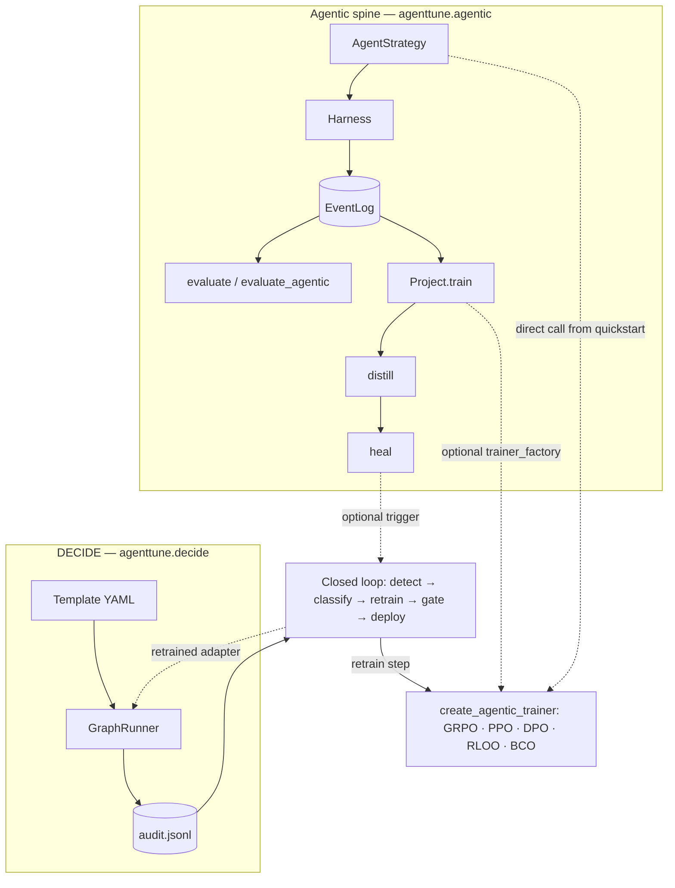

---
hide:
  - navigation
  - toc
---

<div class="at-hero" markdown>


# Train agents that call tools { .at-hero-title }

<p class="at-tagline">
AgentTune builds agentic workflows, then trains, evaluates, distills, and self-heals them,
using one normalized trajectory schema, <code>EventLog</code>, for every stage.
</p>

[Get started](getting-started/installation.md){ .md-button .md-button--primary }
[View on GitHub](https://github.com/Lexsi-Labs/AgentTune){ .md-button }

<p class="at-chips">
<span>v1.0.0</span>
<span>Python 3.12+</span>
<span>agentic-spine core is pure Python</span>
<span>TRL backend</span>
</p>

</div>



AgentTune has two parts:

1. **An RL training layer built on TRL** that trains LLM agents to call tools during
   rollouts, running GRPO, PPO, DPO, RLOO, and BCO through one entry point,
   `create_agentic_trainer(...)`. The spine's own training code, DECIDE's closed-loop
   retrain step, RAG, and multi-agent orchestration all call it directly; it does not
   live inside any one of them. See [Features](features.md) for the full list.
2. **The agentic spine** on top of it: a single normalized trajectory format (`EventLog`)
   that carries one agent artifact through its lifecycle: **build → collect →
   evaluate → train → distill → heal.**

Most agent tooling covers running an agent design. AgentTune also trains, evaluates, distills,
and self-heals that design, and every stage uses the same data schema.

<div class="grid cards" markdown>

-   :material-robot-outline:{ .lg .middle } **Agent design layer**

    ---

    5 swappable strategies (ReAct, Plan-and-Solve, Reflexion, MemoryReAct, Tree-of-Thoughts)
    behind one interface. See [Features](features.md).

-   :material-tune-vertical:{ .lg .middle } **RL trainer**

    ---

    GRPO, PPO, DPO, RLOO, and BCO through `create_agentic_trainer(...)`, on the TRL
    backend.

-   :material-vector-polyline:{ .lg .middle } **EventLog trajectory schema**

    ---

    One event-log format that carries a run through evaluation, training, distillation,
    and healing without re-instrumenting anything.

-   :material-sitemap-outline:{ .lg .middle } **DECIDE**

    ---

    Define a decision workflow as YAML instead of code, across 8 stage types
    (`llm_call`, `llm_judge`, `rules`, `router`, `parallel`, `human_review`, `tool_call`,
    `output`). See [Concepts](concepts/decide-and-closed-loop.md).

-   :material-heart-pulse:{ .lg .middle } **Self-healing closed loop**

    ---

    Detect a failing agent, classify the failure, retrain on it (DPO or BCO), and
    gate redeployment on accuracy.

-   :material-database-search-outline:{ .lg .middle } **Agentic RAG + data synthesis**

    ---

    Train a tool-using search agent end-to-end, or turn a document corpus into a
    difficulty-tagged, grounded QA training set.

</div>

## Start here

- **[Getting Started](getting-started/installation.md)**: install, then run your first episode with
  no model, no network, and no GPU.
- **[Features](features.md)**: every capability in the library, each linked to a notebook
  that runs it.
- **[Concepts: DECIDE & the closed loop](concepts/decide-and-closed-loop.md)**: how the
  YAML decision engine and the self-healing retrain/deploy loop fit together.
- **[Local Notebooks](notebooks/local-notebook.md)**: 45 total, 30 in `docs/notebooks/`
  (the 11 core use-case walkthroughs covering agentic spine lifecycle, RAG, DECIDE, self-healing,
  and industry examples, plus 19 more covering every RL algorithm, sandboxed execution, the
  tool library, reward defenses, and more) and 15 in `examples/USECASES/`. Nine are also on
  [Colab](notebooks/sample-notebook.md).
- **[Python API](user-guide/agentic-spine.md)**: every standalone-usable class
  and function across the package, with exactly what each one needs to run (nothing, a
  GPU, an API key, an optional extra). See also
  **[Known Issues](community/known-issues.md)** for what a code-level audit found broken or
  orphaned. Read that before assuming something documented elsewhere runs
  end-to-end.

This is the AgentTune documentation site. See the
[root README](https://github.com/Lexsi-Labs/AgentTune) for the full project
overview, or clone this repo directly to run everything linked from here.

All 30 notebooks were executed fresh in this environment with actual models and data, with no
error cells and no `!python script.py` shell-outs. Where running the code surfaced a bug, the
notebook's notes describe it and link the upstream fix.

## Installation & quick start

See **[Getting Started](getting-started/installation.md)** for the install command, the two optional
extras, and a walked-through first episode (no model, no network, no GPU). For a full
walkthrough with a model, go straight to the
[Local Notebooks](notebooks/local-notebook.md) index and start with notebook 1.

[`src/agenttune/agentic/README.md`](https://github.com/Lexsi-Labs/AgentTune/blob/main/src/agenttune/agentic/README.md)
is the de-facto API reference for the spine. [`examples/README.md`](https://github.com/Lexsi-Labs/AgentTune/blob/main/examples/README.md)
indexes the runnable examples, and [`docs/notebooks/local-notebook.md`](notebooks/local-notebook.md) indexes the notebooks.

## Support

- **GitHub Issues**: [Report bugs](https://github.com/Lexsi-Labs/AgentTune/issues)
- **Documentation**: you're already here, see [Start here](#start-here) above
- **Security**: see [SECURITY.md](https://github.com/Lexsi-Labs/AgentTune/blob/main/SECURITY.md) for how to report a vulnerability
- **Email**: [hello@lexsi.ai](mailto:hello@lexsi.ai)
- **Discord**: [Discord Lexsi Labs](https://discord.com/invite/dtEDQ2Z3eg)

## Citation

If you use AgentTune in your research, please cite:

**BibTeX:**
```bibtex
@misc{lyngkhoi2026agenttune,
  title        = {{AgentTune}: A Toolkit for Agentic Fine-Tuning, Distillation, and Evaluation},
  author       = {Lyngkhoi, R. E. Zera Marveen and
                  Gupta, Abhivansh and
                  Vats, Vidushee and
                  Kadiyala, Ram Mohan Rao and
                  Sankarapu, Vinay Kumar and
                  Seth, Pratinav},
  year         = {2026},
  howpublished = {\url{https://github.com/Lexsi-Labs/AgentTune}},
  note         = {Software library}
}
```

**Plain Text:**
```
Lyngkhoi, R. E. Z. M., Gupta, A., Vats, V., Kadiyala, R. M. R., Sankarapu, V. K., & Seth, P. (2026).
AgentTune: A toolkit for agentic fine-tuning, distillation, and evaluation.
https://github.com/Lexsi-Labs/AgentTune

Equal contribution: R. E. Zera Marveen Lyngkhoi, Abhivansh Gupta, Vidushee Vats
Corresponding author: Pratinav Seth
```

## Contact

<div align="center" markdown>

<a href="https://lexsi.ai/">

</a>

<https://www.lexsi.ai>

Paris 🇫🇷 · Mumbai 🇮🇳 · London 🇬🇧

</div>
