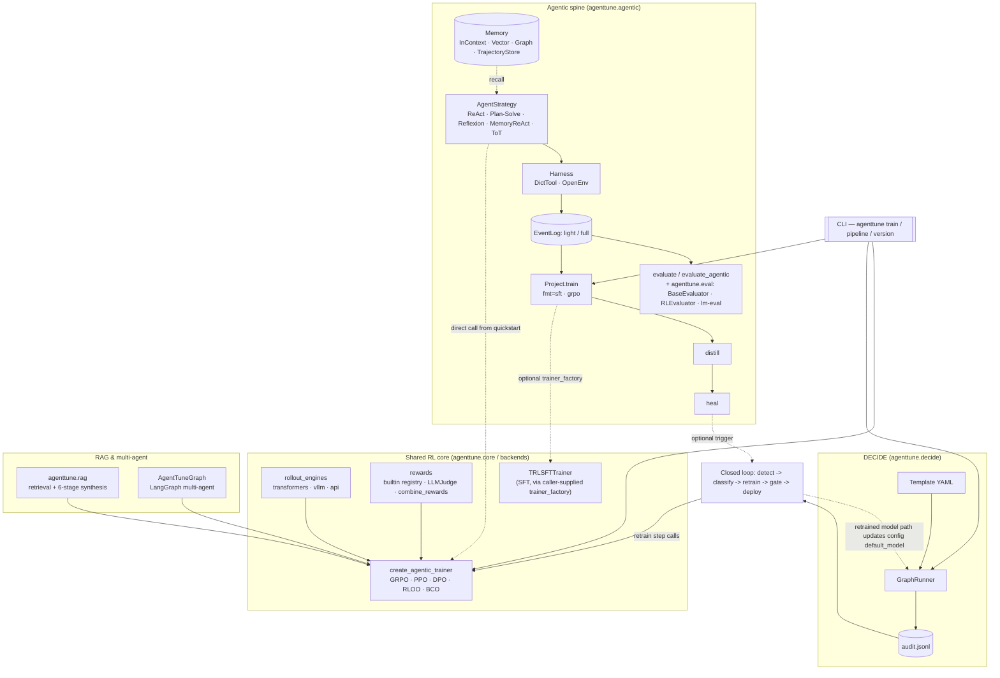

# Architecture

AgentTune is two core systems — the agentic spine and DECIDE — plus a shared RL training
core that both of them, RAG, and multi-agent orchestration all dispatch through. This page
is a map of how the pieces fit; for the full narrative see [Features](../features.md) and
[Concepts: DECIDE & the closed loop](../concepts/decide-and-closed-loop.md).

## The system map

1. **The agentic spine** (`agenttune.agentic`): build an agent from a `AgentStrategy` +
   `Harness`, run it through a `Project`, and every stage reads/writes the same normalized
   `EventLog`. That log is the invariant that lets one artifact flow through evaluation,
   training, distillation, and self-healing without re-instrumenting anything.
   `Project.train()` is its own path (`fmt='sft'` by default, or `fmt='grpo'`) — it builds
   its own rollout function and takes a caller-supplied `trainer_factory`; it does not call
   `create_agentic_trainer` itself.
2. **The shared RL core** (`agenttune.core.backend_factory.create_agentic_trainer`): a
   standalone factory dispatching real TRL-backed GRPO/PPO/DPO/RLOO/BCO trainers. It is
   *not* spine-internal machinery — it's called directly by the quickstart pattern, by
   `agenttune.api.train_agentic()` (the public top-level wrapper), by the RAG package's own
   training script, by `AgentTuneGraph` multi-agent orchestration (which compiles to a
   `rollout_func`/`reward_func` and feeds it in), and — critically — by DECIDE's closed
   loop for its retrain step. SFT is a separate, adjacent path (`TRLSFTTrainer`, wired
   up via a caller-supplied `trainer_factory` — see `RealSFTTrainerFactory` in
   `docs/user-guide/distillation.md` for a working example) that only
   `Project.train(fmt='sft')` wires up; `create_agentic_trainer` has no SFT case.
3. **DECIDE** (`agenttune.decide`): a YAML-defined decision-workflow engine
   (`GraphRunner`) for the "run this in production and log every decision" side of the
   system. Its append-only `audit.jsonl` is the only input the closed loop reads.
4. **RAG and multi-agent orchestration** (`agenttune.rag`, `AgentTuneGraph`): two more
   direct callers of the shared RL core — the RAG package's training script trains a
   tool-using search agent, and `AgentTuneGraph` compiles a multi-agent LangGraph into a
   `rollout_func`/`reward_func` pair and feeds both straight into `create_agentic_trainer`.
5. **The CLI** (`agenttune.cli`): the `agenttune train` / `pipeline` / `version` commands
   are the non-Python entry points into the same three systems above.

The spine and DECIDE connect through two shared boundaries: the **RL core** above (both
call `create_agentic_trainer` directly), and the **closed loop**, which watches DECIDE's
audit log, detects a failing/looping agent, classifies the failure, generates a corrective
training example, calls `create_agentic_trainer` to retrain, and gates redeployment on real
accuracy — writing the retrained model's path into `config.yaml`'s `default_model`, which
`GraphRunner` reads on its next run. See
[Concepts](../concepts/decide-and-closed-loop.md) for how the two stages — detection,
and retrain/gate/deploy — map to the diagram above.

## Package layout (`src/agenttune/`)

What each package is actually for, not just where the files live. Each links to the
[Python API](../user-guide/agentic-spine.md) page with the full standalone-usability
inventory for that area.

- **`agentic/`**: the spine itself. Everything needed to *build* an agent (5 strategies:
  ReAct, Plan-and-Solve, Reflexion, MemoryReAct, Tree-of-Thoughts), give it something to
  act in (`Harness`, a builtin tool library), let it remember things across episodes (4
  memory backends), and run it end-to-end through `Project`, which is also the thing that
  logs every step into the shared `EventLog` format, scores trajectories, drives training/
  distillation, and triggers self-healing. See
  [Python API: Agentic Spine](../user-guide/agentic-spine.md) and
  [How-To: Distillation](../user-guide/distillation.md).
- **`decide/`**: a separate system: define a decision workflow as YAML instead of code
  (`GraphRunner`, the 8 stage types under `decide/stages/`, 24 real templates under
  `decide/templates/`), run it in production, and log every decision to an audit trail.
  `decide/closed_loop/` is the self-healing system built on top of that audit trail; see
  [Python API: DECIDE Engine](decide-engine.md),
  [How-To: Set Up a DECIDE Pipeline](../user-guide/decide-workflows.md), and
  [How-To: Self-Healing](../user-guide/self-healing.md).
- **`core/`**: the RL training factory (`core/backend_factory.py`'s
  `create_agentic_trainer`, dispatching to real TRL-backed GRPO/DPO/PPO/RLOO/BCO trainers)
  plus config/eval scaffolding under `core/sft/`. See
  [Algorithms Overview](../algorithms/overview.md) and
  [How-To: Train an Agent with RL](../user-guide/rl-training.md).
- **`backends/`**: the actual trainer implementation classes `core/backend_factory.py`
  dispatches to: TRL-backed wrappers, real and wired in.
- **`eval/`**: two separate real eval systems: a "Universal" framework
  (`BaseEvaluator`/`RLEvaluator`, exported and actually used by SFT eval) and a standalone
  tool-use agent evaluator (`agent_eval.py`'s `run_eval`, real but not part of the exported
  public surface). Plus `lm-eval` integration and a sandboxed code-execution engine. See
  [Python API: Evaluation](../user-guide/evaluation.md).
- **`rag/`**: two things bundled together: training a tool-using search agent end-to-end
  (real retrieval backends, real rewards), and a separate 6-stage pipeline that turns a
  document corpus into a difficulty-tagged, grounded QA training set. See
  [Python API: RAG & Data Synthesis](../user-guide/rag-and-synthesis.md).
- **`data/`, `utils/`, `scenarios/`**: dataset loading/preprocessing
  (`data/manager.py`'s `DataManager`), a large collection of standalone diagnostics/
  helpers (device detection, environment checks, checkpointing, config utilities), and
  synthetic agent-scenario generation. See
  [Python API: Data & Utilities](data-and-utils.md).
- **`cli/`**: the real `agenttune` console commands (`version`, `pipeline`, `train`,
  plus the whole `decide` sub-app). See [CLI](cli.md), including which parts of this
  package look like a CLI but aren't reachable.

Multi-agent orchestration (`AgentTuneGraph`, real `langgraph`-library-backed) lives at
`agenttune.agentic.langgraph_orchestrator`, not at the top-level `src/agenttune/langgraph/`
package; that path is an unused duplicate left over from a refactor; nothing in the repo
imports it.

[`src/agenttune/agentic/README.md`](https://github.com/Lexsi-Labs/AgentTune/blob/main/src/agenttune/agentic/README.md)
and [Python API](../user-guide/agentic-spine.md) are the
de-facto reference for the spine package until a generated API reference is wired up.

## Where things run

- The agentic-spine core (`agenttune.agentic`) is pure Python; no GPU, network, or heavy
  ML dependency required to build and run a strategy/harness/`EventLog` episode. See
  [Getting Started](../getting-started/installation.md).
- Training real models (any RL algorithm, via TRL) needs the base install
  (`pip install -e .`, which already pulls in `torch`, `transformers`, and `trl`) and a GPU.
- DECIDE pipelines run anywhere Python runs; the LLM backends they call
  (`default_model` / `judge_model` in [`config.yaml`](configuration.md)) determine whether
  that also needs a GPU.
- The sandboxed `OpenEnv` harness driver (running tool calls in an isolated remote
  environment instead of in-process) is a base dependency; no extra install needed.
- `agenttune[service]` adds a FastAPI + WebSocket demo backend and the operator UI
  (`src/agenttune/agentic/service/static/`).
