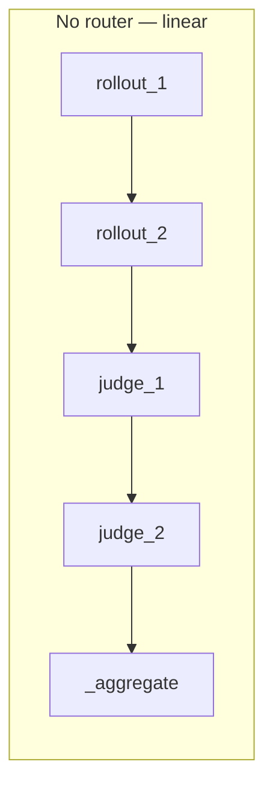
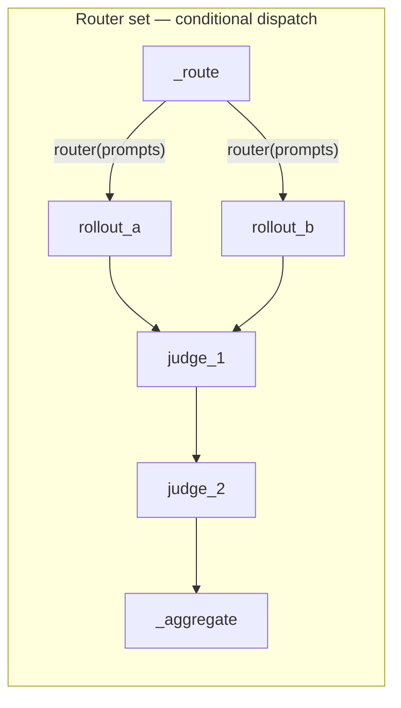

# Multi-Agent Orchestration with LangGraph

`AgentTuneGraph` composes multiple rollout functions and multiple LLM judges into one
[LangGraph](https://github.com/langchain-ai/langgraph) `StateGraph`, auto-wiring outputs
between nodes by inspecting each node's parameter names, no manual plumbing. It compiles
to drop-in callables for three different consumers: a GRPO `rollout_func`, a GRPO
`reward_func`, and a plain per-trajectory `reward_fn` for use outside training entirely.

This is genuinely wired into the codebase, not a standalone demo: `decide/
trainer_config_bridge.py`'s `build_multi_agent_graph()` builds one from YAML config for
real training runs, and `tests/e2e_test_suite.py` exercises three real patterns (T6–T8:
rollout-only, rollout + dual judge, conditional router) end to end against a live model.

!!! note "Import path"
    Import from `agenttune.agentic.langgraph_orchestrator`, not
    `agenttune.langgraph.langgraph`. The real implementation lives in the latter, but
    the former is the canonical path (a small re-export shim), and the only one
    anything in the repo actually imports:

    ```python
    from agenttune.agentic.langgraph_orchestrator import AgentTuneGraph, make_grpo_rollout_func
    ```

    `src/agenttune/langgraph/` is a second, functionally-identical copy of the same code
    that nothing imports, an orphaned duplicate, not a second implementation to choose
    between. See [Known Issues](../community/known-issues.md).

## The building blocks

Three real components go into a graph:

- **Rollout nodes**: the output of `create_rollout_fn()`
  (`agentic/rollout_engines/rollout_factory.py`): a callable that runs an agent episode
  against a `RolloutEngine` and returns a dict of trajectories/responses/rewards.
- **Judge nodes**: `LLMJudge` instances (`agentic/rewards/llm_judge.py`): score a
  trajectory against a rubric, via a hosted API, a local `transformers` model, or a
  local `vllm` model.
- **A router** (optional): a plain function that picks *one* rollout node to run
  instead of running every registered rollout node in sequence.

### Building a rollout node

```python
from agenttune.agentic.rollout_engines.rollout_factory import create_rollout_engine, create_rollout_fn

engine_a = create_rollout_engine(backend="transformers", model_path="Qwen/Qwen2.5-1.5B-Instruct")
engine_b = create_rollout_engine(backend="transformers", model_path="Qwen/Qwen2.5-1.5B-Instruct")

rollout_tool_agent = create_rollout_fn(
    rollout_engine=engine_a,
    tools=[calculator_tool, converter_tool],
    max_steps=5,
    system_prompt="You are a tool-using math assistant.",
)
rollout_code_agent = create_rollout_fn(
    rollout_engine=engine_b,
    tools=[calculator_tool],
    max_steps=3,
    system_prompt="Answer briefly, show your work.",
)
```

`create_rollout_engine(backend="auto"|"transformers"|"vllm", model_path=..., **kwargs)`
picks vLLM if it's importable and falls back to `transformers` otherwise (or builds
whichever backend you name explicitly). `create_rollout_fn(rollout_engine=..., tools=,
max_steps=, system_prompt=, reward_fn=, ...)` returns a plain callable:
`rollout_fn(prompts: list[str], **gen_kwargs) -> dict`, with keys including
`trajectories`, `responses`, `rewards`, `conversations`, `logprobs`, `prompt_ids`,
`completion_ids`, and `tool_call_counts`. Those key names matter: `AgentTuneGraph`'s
auto-wiring reads exactly these keys back out of shared state for the next node.

### Building a judge node

```python
from agenttune.agentic.rewards.llm_judge import LLMJudge

judge_correctness = LLMJudge(
    model="gpt-4o-mini",
    system_prompt='Rate correctness 0-1. Return {"score": <float>, "explanation": ""}',
)

judge_strict_local = LLMJudge(
    backend="transformers",
    model_path="Qwen/Qwen2.5-0.5B-Instruct",
    system_prompt="You are a strict grader. Penalize any unnecessary tool call.",
)
```

`LLMJudge.__init__` takes `model` (a litellm-style name, used when no local `backend` is
given), `backend` (`"transformers"` or `"vllm"`, for a local judge model; `model_path`
is required with either), `model_path`, `rollout_engine` (reuse an existing engine
instead of building a new one), `api_key`, `base_url`, and `system_prompt`. There is no
`api_base_url` parameter; that's `base_url`. Its `evaluate_trajectory(task: str,
trajectory, criteria: dict | None = None) -> float` scores a single trajectory in
`[0, 1]` and caches by `(task, trajectory, criteria)` so re-scoring the same trajectory
under the same criteria is free.

## Building the graph

```python
from agenttune.agentic.langgraph_orchestrator import AgentTuneGraph

graph = AgentTuneGraph()
graph.add_rollout("tool_agent", rollout_tool_agent)
graph.add_rollout("code_agent", rollout_code_agent)
graph.add_judge("correctness", judge_correctness, criteria={"accuracy": 0.7}, aggregation="mean")
graph.add_judge("strictness",  judge_strict_local, criteria={"clarity": 0.3}, aggregation="min")

# Route each prompt batch to ONE rollout node instead of running both in sequence:
graph.set_router(lambda prompts: "code_agent" if "```" in prompts[0] else "tool_agent")

# How multiple judges combine into one final_reward (per-judge aggregation is set
# separately via each add_judge(..., aggregation=...) call above):
graph.set_final_aggregation("mean")   # "mean" | "min" | "max" | a callable(list[float]) -> float
```

`add_rollout(name, rollout_fn)` and `add_judge(name, judge, criteria=None,
aggregation="mean")` both return `self`, so calls chain. Registering the same name twice
warns and replaces the earlier registration rather than duplicating the node.
`aggregation` on `add_judge` controls how that one judge's per-trajectory scores combine
(`"mean"`, `"min"`, `"max"`, or a callable); `set_final_aggregation` controls how the
*different judges'* scores combine into `final_reward`. Without `set_router`, all
registered rollout nodes run in sequence; each rollout's output merges into shared
state before the next node runs, followed by all judges in sequence, then an internal
`_aggregate` node.

### What a judge actually sees

`criteria` on `add_judge` isn't structural; it's rendered straight into the judge's
prompt as a weighted checklist. `LLMJudge._build_absolute_prompt` (called from
`evaluate_trajectory`) turns `{"accuracy": 0.7}` into `"Criteria:\n  - accuracy (weight
0.70)"` ahead of the formatted trajectory, then asks for a strict `{"score": <float
0-1>, "explanation": "..."}` JSON response, so two judges wrapping the *same* rubric
template but registered with different `criteria` dicts (as in the correctness/clarity
example above) genuinely see different prompts, not just different labels. The
trajectory itself is whatever the rollout node produced: a `Trajectory` dataclass
(`agentic/trajectory/dataset.py`) carrying `task`, `steps`, `reward`, `final_response`,
and `metadata`; `evaluate_trajectory`'s `task` argument comes from `trajectory.task`,
read by the graph automatically (`task = getattr(traj, "task", "")`) so you never pass
it explicitly when going through `add_judge`.

### Auto-wiring: how nodes see each other's output

Before calling a rollout node, the orchestrator inspects that node's function signature
and injects any matching key from accumulated shared state. `prompts` is always
injected; `trajectories`/`responses`/`rewards` from a previous rollout node are injected
if the next node's signature names them; anything else is looked up by name in
`state["shared"]`. Judge nodes are simpler and fixed: each registered judge's
`evaluate_trajectory` is called once per trajectory in `state["shared"]["trajectories"]`,
with `task=trajectory.task`, `trajectory=trajectory`, `criteria=<that judge's registered
criteria>`. If no rollout node has produced trajectories yet, a judge node warns and
scores a neutral `0.5` rather than crashing.

## Compiling: three consumers, one graph

### `compile_rollout()`: for `GRPOTrainer(rollout_func=...)`

```python
unified_rollout_fn = graph.compile_rollout()

out = unified_rollout_fn(["What is 12 * 12?", "Convert 5 miles to km."])
print(out.keys())
# dict_keys([..., 'trajectories', 'responses', 'rewards', 'judge_scores', 'final_reward', 'judge_rewards'])
```

`compile_rollout()` returns a callable with signature `(prompts, *args, **gen_kwargs) ->
dict`. Its output is the *last* rollout node's raw output dict, merged with
`judge_scores` (per-judge aggregate), `final_reward` (aggregate across judges), and,
critically for GRPO, `judge_rewards`: a length-N vector with one score per completion
(element-wise aggregate of every judge's per-trajectory score at that index), computed
by the internal `_aggregate` node. `final_reward`/`judge_scores` alone are batch-level
scalars; `judge_rewards` is what lets a `reward_func` assign a different score to each
of N sampled completions per prompt, which GRPO needs.

### `compile_grpo_reward()`: for `GRPOTrainer(reward_funcs=[...])`

```python
grpo_reward_func = graph.compile_grpo_reward()
```

Returns `reward_func(completions=None, judge_rewards=None, trajectories=None, **kwargs)
-> list[float]`, the exact shape `GRPOTrainer(reward_funcs=[...])` calls. Pair it with
`compile_rollout()`: the rollout runs every judge once and exposes the per-completion
`judge_rewards` vector, which GRPOTrainer forwards straight into the reward func's
kwargs: the fast path. If `judge_rewards` is missing or short (e.g. the rollout ran
without judges), it falls back to re-running `compile_reward()` over each trajectory;
correct either way, just not free on the fallback path since the judges run twice.

### `compile_reward()`: a plain scoring function, no training required

```python
score_fn = graph.compile_reward()   # trajectory -> float, judges only, no rollout involved

for traj in some_trajectories:
    print(score_fn(traj))
```

This is the piece worth calling out on its own: `compile_reward()` needs no rollout
node, no `GRPOTrainer`, no training loop at all; it just runs every registered judge
against a single `Trajectory` object (reading `trajectory.task`) and combines their
scores with `set_final_aggregation()`'s strategy. Use it to score trajectories you
already have (from a notebook, an eval run, a manual review queue) exactly the same way
your judges would score them during training: one graph, one aggregation rule, used
in two different places without redefining anything. It's also what `add_rollout`-only
graphs fall back to: with zero judges registered, `compile_reward()` warns and returns a
constant `lambda t: 0.5` rather than raising, so an accidentally judge-less graph fails
loud in the logs, not silently at training time. It's also what `compile_rollout()`'s
own auto-wiring is built from; passing it to `create_rollout_fn(..., reward_fn=...)`
scores one trajectory at a time inside the rollout loop itself, as an alternative to
running judges as separate graph nodes.

### `AgentTuneGraph` method reference

| Method | Signature | Returns |
|---|---|---|
| `add_rollout` | `(name: str, rollout_fn: Callable) -> AgentTuneGraph` | `self` (chainable) |
| `add_judge` | `(name: str, judge: Any, criteria: dict \| None = None, aggregation: "mean"\|"min"\|"max"\|Callable = "mean") -> AgentTuneGraph` | `self` (chainable) |
| `set_router` | `(router_fn: Callable[[list[str]], str]) -> AgentTuneGraph` | `self` (chainable) |
| `set_final_aggregation` | `(strategy: "mean"\|"min"\|"max"\|Callable = "mean") -> AgentTuneGraph` | `self` (chainable) |
| `compile_rollout` | `() -> Callable` | `unified_rollout_fn(prompts, **gen_kwargs) -> dict` |
| `compile_reward` | `() -> Callable` | `reward_fn(trajectory) -> float` |
| `compile_grpo_reward` | `() -> Callable` | `reward_func(completions=None, judge_rewards=None, trajectories=None, **kwargs) -> list[float]` |

Built-in aggregation strategies (`"mean"`, `"min"`, `"max"`) map directly to Python's
`statistics.mean`/`min`/`max` over a `list[float]`; pass any `Callable[[list[float]],
float]` instead for something custom (a weighted average, a percentile, whatever the
judge ensemble needs). The same three-string-or-callable contract is used in both
`add_judge(..., aggregation=)` (per-judge, across that judge's trajectory scores) and
`set_final_aggregation(...)` (across judges, into `final_reward`).

## Graph shape

Nodes are wired in registration order. Without a router, every rollout runs in
sequence, feeding the next via shared state, then every judge runs in sequence, then an
internal aggregation node builds the final output:



With a router, a `_route` node picks exactly one rollout node per call via a
conditional edge; the judges still run against whatever that single node produced:



`_aggregate` is where `final_reward` (aggregate across judges, via
`set_final_aggregation()`) and `judge_rewards` (per-completion vector, aggregate across
judges *for each completion index*) both get computed; see `compile_rollout()` below
for why that per-completion vector is the piece GRPO actually needs.

## Testing a graph with zero GPU or API key

Every node in `AgentTuneGraph` is duck-typed, not `isinstance`-checked: a rollout node
just needs to be `Callable[[list[str], ...], dict]`, and a judge node just needs an
`evaluate_trajectory(task, trajectory, criteria) -> float` method. That means the whole
compile-and-run mechanism (routing, aggregation, the `judge_rewards` per-completion
vector) is testable with trivial fakes, no model load at all:

```python
from dataclasses import dataclass, field
from agenttune.agentic.langgraph_orchestrator import AgentTuneGraph

@dataclass
class FakeTrajectory:
    task: str
    final_response: str = "42"
    reward: float = 0.0

def fake_rollout(prompts, **kwargs):
    trajs = [FakeTrajectory(task=p) for p in prompts]
    return {"trajectories": trajs, "responses": [t.final_response for t in trajs],
            "rewards": [0.0 for _ in trajs]}

class FakeJudge:
    def __init__(self, score: float):
        self._score = score
    def evaluate_trajectory(self, task, trajectory, criteria=None):
        return self._score

graph = AgentTuneGraph()
graph.add_rollout("agent", fake_rollout)
graph.add_judge("lenient", FakeJudge(0.9))
graph.add_judge("strict",  FakeJudge(0.3), aggregation="min")
graph.set_final_aggregation("mean")

out = graph.compile_rollout()(["task one", "task two"])
print(out["judge_scores"])   # {'lenient': 0.9, 'strict': 0.3}
print(out["final_reward"])  # 0.6  (mean of 0.9 and 0.3)
print(out["judge_rewards"]) # [0.6, 0.6] — same aggregate at every completion index,
                             # since both fakes return a constant score regardless of trajectory
```

Use this to unit-test router logic, aggregation strategy choices, or the
`judge_rewards`-vs-`compile_reward()`-fallback path in `compile_grpo_reward()` before
ever loading a real model.

## Wiring the compiled graph into a real trainer

```python
from agenttune.core.backend_factory import create_agentic_trainer
from agenttune.agentic.langgraph_orchestrator import make_grpo_rollout_func

graph = AgentTuneGraph()
graph.add_rollout("agent", rollout_tool_agent)
graph.add_judge("quality", judge_correctness)

trainer = create_agentic_trainer(
    algorithm="grpo",
    model="Qwen/Qwen2.5-1.5B-Instruct",
    train_dataset=my_prompt_dataset,
    rollout_func=make_grpo_rollout_func(graph.compile_rollout()),
    reward_funcs=[graph.compile_grpo_reward()],
    output_dir="./runs/multi_agent_grpo",
)
result = trainer.train()
```

`create_agentic_trainer(algorithm="grpo", **kwargs)` (`core/backend_factory.py`) builds
AgentTune's GRPO trainer, which wraps TRL's `GRPOTrainer` and forwards `rollout_func`/
`reward_funcs` straight through. `make_grpo_rollout_func` (module-level, same import
path as `AgentTuneGraph`) is the adapter between the two calling conventions:

```python
def make_grpo_rollout_func(unified_rollout_fn: Callable) -> Callable:
    def grpo_rollout_func(prompts: List[str], trainer) -> Dict[str, Any]:
        gen_kwargs: Dict[str, Any] = {}
        for attr in ("temperature", "max_completion_length", "processing_class"):
            val = getattr(trainer, attr, None)
            if val is not None:
                gen_kwargs[attr] = val
        if "processing_class" in gen_kwargs and "tokenizer" not in gen_kwargs:
            gen_kwargs["tokenizer"] = gen_kwargs["processing_class"]
        return unified_rollout_fn(prompts, **gen_kwargs)
    return grpo_rollout_func
```

`GRPOTrainer` calls its `rollout_func` as `rollout_func(prompts, trainer)`, passing
itself so the rollout can read its live `temperature`/`max_completion_length`/tokenizer.
`AgentTuneGraph.compile_rollout()`'s output doesn't take a `trainer` argument, so
`make_grpo_rollout_func` bridges the two: it pulls the three attributes off the trainer
instance and forwards them as `**gen_kwargs`, aliasing `processing_class` to `tokenizer`
so any rollout function that asks for `tokenizer=` gets it without either side needing
to know about the other's naming.

This exact pattern (`build_multi_agent_graph()` then
`kwargs["rollout_func"] = make_grpo_rollout_func(rollout_fn)` then
`create_agentic_trainer(**kwargs)`) is what `decide/trainer_config_bridge.py`'s
`build_trainer()` does for real when a DECIDE YAML config sets
`training.multi_agent.enabled: true`, reading `rollouts`/`judges`/`router`/
`final_aggregation` straight out of that config section:

```python
def build_multi_agent_graph(self):
    graph = AgentTuneGraph()
    for rollout_cfg in ma_cfg.get("rollouts", []):
        engine = self.build_rollout_engine(rollout_cfg)
        rollout_fn = self.build_rollout_fn(engine, rollout_cfg)
        graph.add_rollout(rollout_cfg["name"], rollout_fn)
    for judge_cfg in ma_cfg.get("judges", []):
        judge = LLMJudge(**{k: judge_cfg[k] for k in
                             ("model", "base_url", "api_key", "system_prompt",
                              "backend", "model_path") if k in judge_cfg})
        graph.add_judge(judge_cfg["name"], judge,
                        aggregation=judge_cfg.get("aggregation", "mean"))
    if ma_cfg.get("router"):
        graph.set_router(eval(f"lambda prompts: {ma_cfg['router']}"))
    if ma_cfg.get("final_aggregation"):
        graph.set_final_aggregation(ma_cfg["final_aggregation"])
    return graph.compile_rollout(), graph.compile_reward()
```

That's the same `LLMJudge` field names documented above (`model`, `backend`,
`model_path`, `api_key`, `base_url`, `system_prompt`) read straight out of a config
dict, confirming those are the real constructor kwargs, not just this page's opinion
of them.

## A full worked example: two rollouts, two judges, a router, GRPO

Putting the pieces together end to end. This mirrors `tests/e2e_test_suite.py`'s T8
pattern (conditional router) extended with the dual-judge scoring from T7:

```python
from agenttune.agentic.langgraph_orchestrator import AgentTuneGraph, make_grpo_rollout_func
from agenttune.agentic.rollout_engines.rollout_factory import create_rollout_engine, create_rollout_fn
from agenttune.agentic.rewards.llm_judge import LLMJudge
from agenttune.core.backend_factory import create_agentic_trainer

MODEL = "Qwen/Qwen2.5-1.5B-Instruct"

# Two rollout nodes, different tool sets / step budgets.
engine_simple  = create_rollout_engine(backend="transformers", model_path=MODEL)
engine_complex = create_rollout_engine(backend="transformers", model_path=MODEL)

rollout_simple  = create_rollout_fn(engine_simple,  tools=[calculator_tool],
                                     max_steps=2, system_prompt="Answer briefly.")
rollout_complex = create_rollout_fn(engine_complex, tools=[calculator_tool, converter_tool],
                                     max_steps=4, system_prompt="Be thorough, show your work.")

def router(prompts: list[str]) -> str:
    return "complex" if "convert" in prompts[0].lower() else "simple"

# Two judge nodes, different rubrics.
judge_correctness = LLMJudge(
    backend="transformers", model_path=MODEL,
    system_prompt='Rate correctness 0-1. Return {"score": <float>, "explanation": ""}',
)
judge_clarity = LLMJudge(
    backend="transformers", model_path=MODEL,
    system_prompt='Rate clarity 0-1. Return {"score": <float>, "explanation": ""}',
)

graph = AgentTuneGraph()
graph.add_rollout("simple",  rollout_simple)
graph.add_rollout("complex", rollout_complex)
graph.set_router(router)
graph.add_judge("correctness", judge_correctness, criteria={"accuracy": 0.7}, aggregation="mean")
graph.add_judge("clarity",     judge_clarity,     criteria={"clarity": 0.3},  aggregation="mean")
graph.set_final_aggregation("mean")

# 1. Standalone sanity check — no trainer involved yet.
unified = graph.compile_rollout()
out_simple  = unified(["What is 2 + 2?"])
out_complex = unified(["Convert 10 km to miles."])
print(out_simple["final_reward"], out_complex["final_reward"])

# 2. Wire into a real GRPO run.
trainer = create_agentic_trainer(
    algorithm="grpo",
    model=MODEL,
    train_dataset=my_prompt_dataset,
    rollout_func=make_grpo_rollout_func(graph.compile_rollout()),
    reward_funcs=[graph.compile_grpo_reward()],
    output_dir="./runs/router_grpo",
)
result = trainer.train()
```

With a router set, only the chosen rollout node runs per call. `_route_node` picks a
name via `router(prompts)`, LangGraph's conditional edge dispatches to that single
node, and both judges then run against whatever trajectories it produced. Without a
router, every registered rollout node runs in sequence on every call instead.

## What needs a model vs. what's pure Python

| Component | Needs | Rating |
|---|---|---|
| `AgentTuneGraph` construction, wiring, routing, aggregation logic | nothing, pure Python, testable with fakes (above) | A |
| `compile_rollout()` / `compile_reward()` / `compile_grpo_reward()` themselves | nothing to *compile*, the returned callables need whatever their nodes need | A |
| A rollout node (`create_rollout_fn` output) | a `RolloutEngine`: `transformers` (local weights) or `vllm` (local weights, faster) | B |
| A judge node with `backend="transformers"`/`"vllm"` | local weights at `model_path` | B |
| A judge node with only `model=` set (no `backend`) | a hosted API key via `litellm` | B |
| `make_grpo_rollout_func` | nothing itself, it's a plain kwarg-forwarding adapter | A |
| `create_agentic_trainer(algorithm="grpo", ...)` | `trl` installed, a real model, a GPU for anything beyond a toy run | B |

Reusing one `RolloutEngine` across a judge and a rollout node (pass it as
`LLMJudge(rollout_engine=my_engine, ...)`) avoids loading the same model weights twice,
worth doing whenever a judge and a rollout share a model.

## Troubleshooting

- **A judge node warns `"no trajectories in shared state"` and scores a flat `0.5`.**
  No rollout node ran before it: either you registered a judge with zero rollout
  nodes, or (with a router) the router picked a rollout that produced no trajectories
  in its output dict under the `trajectories` key.
- **`compile_reward()` returns a constant `0.5` for everything.** You called it on a
  graph with zero registered judges. It warns
  `"No judges registered, compile_reward() returns a constant 0.5 fn"` and means it;
  add at least one `add_judge(...)` call first.
- **`compile_grpo_reward()`'s reward func returns `[0.5] * n` for every batch.** Its
  fallback path needs either a `judge_rewards` vector of the right length from the
  rollout output, or non-empty `trajectories`; if both are missing/empty (e.g. a
  rollout function that doesn't emit `trajectories`), there's nothing to score against,
  and `0.5` is the deliberate neutral default rather than a crash.
- **A rollout node's extra kwargs never get filled in.** Auto-wiring only injects
  parameters whose *names* match a key in shared state (`prompts`, `gen_kwargs`, and
  the previous node's merged output); `*args`/`**kwargs` catch-alls in a rollout
  function's signature are explicitly skipped by `_build_kwargs_from_sig`, so a
  wildcard signature won't pick up anything by magic; name the parameter explicitly.
- **Registering a node with a name you've already used silently replaces it.** Check
  for the `UserWarning` (`"Rollout node '...' already registered, overwriting"` /
  the judge equivalent) if a node's behavior doesn't match what you expect from the
  order you added things.

## Notebook and further reading

The corresponding [Local Notebook](../notebooks/local-notebook.md)
walks through `AgentTuneGraph` composing a real rollout node and two divergent LLM-judge
nodes into a reward function that drives a real GRPO LoRA step, the live version of the
`compile_rollout()` / `compile_grpo_reward()` pair above.

- [Known Issues](../community/known-issues.md): real-but-unreachable code paths and other
  edge cases.
- [Guide: Train an Agent with RL](../user-guide/rl-training.md): the single-agent version
  of the GRPO wiring shown above, without a graph in front of it.
- [Reference: RL Training Backends](../algorithms/overview.md):
  what `create_agentic_trainer` actually builds per algorithm.
- [Reference: Agentic Spine](agentic-spine.md): the rollout
  engines, tools, and strategies that feed a rollout node.
