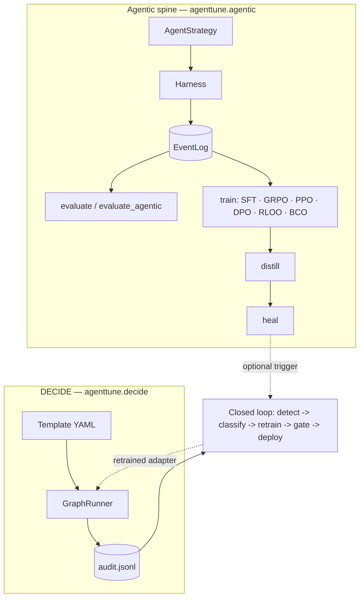

# User Guide Overview

This is the map. [Home](../README.md) and [Features](../features.md) tell you *that*
AgentTune trains, evaluates, distills, and self-heals tool-using agents; this page tells
you *how the pieces fit together* and which User Guide page to open for what you're
actually trying to do. [Basic Concepts](../getting-started/basic-concepts.md) already
covers the vocabulary (`EventLog`, `Harness`, `AgentStrategy`, `Project`); this page
builds on top of that, it doesn't re-explain it.

## Two systems, not one

AgentTune is two separate systems that happen to share one data format:



**The agentic spine** (`agenttune.agentic`) is for *building and training* an agent
design: you write an `AgentStrategy` (the policy) and a `Harness` (the environment),
wire them into a `Project`, and run it through `infer`/`collect`/`evaluate`/`train`/
`distill`/`heal`, all of it reading and writing the same `EventLog`. This is a Python
library you import and call. Nothing about it assumes production traffic or a YAML file.

**DECIDE** (`agenttune.decide`) is for *running a decision workflow in production*: you
define stages (`llm_call`, `router`, `llm_judge`, `rules`, `tool_call`, …) as a YAML
template, `GraphRunner` compiles and executes it, and every run is appended to an audit
log. This is closer to a rules/orchestration engine than an agent-training library; it
doesn't know or care what an `AgentStrategy` is.

They're not layered (one isn't "built on" the other) and they don't require each other;
you can use the spine with no DECIDE workflow in sight, or run DECIDE in production with
no training loop attached. The thing that connects them is optional: the **self-healing
closed loop** watches DECIDE's `audit.jsonl`, detects a failing or looping run, classifies
why, generates a corrective training example, and retrains through the spine's real
trainers, then gates redeployment on real accuracy before it touches production again.
That's the `HE -.optional trigger.-> CL` arrow above: it's a bridge you can build, not a
dependency either system has on the other. See
[Architecture](../reference/architecture.md) for the full package-by-package breakdown, and
[User Guide: DECIDE Workflows](decide-workflows.md) /
[User Guide: Self-Healing](self-healing.md) for how to actually drive DECIDE and the
closed loop.

The shape of the two systems' entry points is deliberately different, because they're
solving different problems. The spine is code you write once and call:

```python
from agenttune.agentic import Project, DictToolHarness, ReActStrategy
proj = Project(strategy=ReActStrategy(policy), harness=DictToolHarness(tools))
```

DECIDE is config you author once and run against arbitrary inputs, unchanged, forever:

```python
from agenttune.decide import GraphRunner
runner = GraphRunner.from_template("generic/text_classify", config_path="config.yaml")
state = runner.run_sync("some input")
```

If you're building an agent that *acts*, calls tools, reasons over multiple steps, needs
its policy trained, you want the spine. If you're encoding a decision process that a
non-engineer should be able to read and change without touching Python (approval rules,
routing logic, an LLM call gated by a business rule), you want DECIDE. DECIDE has its own
`tool_call` stage type that invokes one tool from the same builtin tool library described
on [Agentic Spine](agentic-spine.md) directly; that's the extent of the
overlap today; `Project`'s own `workflow=` constructor argument is explicitly reserved for
a deeper DECIDE integration and unused by the core spine right now (see the docstring in
`agentic/project.py`), so don't go looking for a way to drop a trained multi-step
`AgentStrategy` into a DECIDE pipeline stage; that wiring doesn't exist yet.

## `EventLog`: the lingua franca

The reason there's a "spine" at all, rather than five disconnected tools, is that every
stage speaks the same schema. An `EventLog` is a flat list of typed `Event`s (`TEXT`,
`REASONING`, `TOOL_CALL`, `TOOL_RESULT`, `OBSERVATION`, `TURN_COMPLETE`, `REWARD`,
`MEMORY_OP`) plus a `tier` marker: `"light"` (observational: what happened) or
`"full"` (trainable: also carries token spans and logprobs from a real rollout).

Concretely, this buys you:

- **One evaluator for every source.** A spine episode
  (`run_episode` → `EventLog`), a DECIDE pipeline run (`EventLog.from_pipeline_state`),
  and a bare eval-harness trace (`EventLog.from_eval_dict`) all become the same object, so
  `agentic_metrics()` and the closed loop's failure detector work on all three without
  three separate adapters.
- **One dataset format feeds SFT, distillation, *and* healing.** A full-tier `EventLog`'s
  `.as_dataset_rows("sft")` produces the exact `{messages, segment_weights, loss_mask}`
  shape the real SFT trainer consumes; `Project.train(fmt="sft")` and
  `Project.distill(...)` are both this same method under the hood, over different sets of
  trajectories (yours vs. a teacher's).
- **No re-instrumentation between stages.** You don't write a "training callback" and
  a separate "eval callback" and a separate "audit callback" for one agent; you write the
  agent once, and every downstream stage reads the trajectories it already produced.

The [User Guide: Agentic Spine](agentic-spine.md) page is the deep dive on `EventLog`
itself; its projection methods (`from_trajectory`, `from_pipeline_state`,
`from_eval_dict`), its consumption methods (`rewards()`, `as_dataset_rows()`,
`to_eval_dict()`, `to_audit_records()`), and the light/full tier distinction with real
code for each.

## If you want to do X, go to page Y

Ten destinations, what each one actually covers, and what you need before you get there.

### Build or understand an agent design → [Agentic Spine](agentic-spine.md)

The 5 strategies (ReAct, Plan-and-Solve, Reflexion, MemoryReAct, Tree-of-Thoughts), the 4
memory backends (in-context, trajectory replay, vector, graph), `DictToolHarness` /
`OpenEnvHarness`, the builtin tool library, and `Project`'s full lifecycle API; every one
with a real, runnable example. This is the longest page in the User Guide and the one the
rest of it assumes you've at least skimmed. No GPU needed for any of it.

### Train a tool-using agent's policy → [RL Training](rl-training.md)

GRPO, PPO, DPO, RLOO, and BCO through one entry point, `create_agentic_trainer(...)`, on
the TRL backend. See [Algorithms](../algorithms/grpo.md) (and its
siblings) for the algorithm-level math and hyperparameters, this page for how to actually
invoke training against a spine-built agent. Needs a GPU for anything beyond a toy model.

### Compress a teacher agent into a cheap student → [Distillation](distillation.md)

Behavior cloning, not weight-level KD: a strong (possibly expensive/slow) teacher agent's
own captured trajectories become SFT training data for a small student model, via
`Project.distill(...)` or `TrajectoryStore.as_dataset("sft")` directly. Needs a real
teacher model to roll out against; the student can be much smaller.

### Define a decision workflow as YAML → [DECIDE Workflows](decide-workflows.md)

`GraphRunner.from_template(...)` compiles a YAML file into a graph of stages
(`llm_call`, `router`, `llm_judge`, `rules`, `tool_call`, `parallel`, `output`) and runs
it, config instead of a hand-written script, with every run appended to an audit log.
Templates ship for generic, custom, and BFSI use cases. Runs anywhere Python runs; whether
it also needs a GPU depends on which model your `llm_call`/`llm_judge` stages point at.

### Close the loop on production failures → [Self-Healing](self-healing.md)

Detect a failing or looping run from DECIDE's audit trail, classify why
(`wrong_tool`/`wrong_routing`/etc. via an LLM call), turn it into a training example,
retrain (real DPO), and gate redeployment on real accuracy: six real, correctly-wired
components (`FailureDetector`, `FailureClassifier`, `TrainingExampleGenerator`,
`RetrainingTrigger`, `BackgroundRetrainer`, `DeploymentGate`), including the detection
step itself: `AuditWriter` and `FailureDetector.scan_audit_log` now agree on the audit-log
schema, so pointing the closed loop at a real DECIDE audit log detects real failures. See
[Self-Healing](self-healing.md) for how to run it end to end.

### Coordinate multiple agents in one pipeline → [Multi-Agent Orchestration](multi-agent-orchestration.md)

`agenttune.agentic.langgraph_orchestrator.AgentTuneGraph` wires multiple agents/scoring
steps together via the real `langgraph` library. (There's a second, functionally
identical copy at `agenttune.langgraph`; it's an unused leftover from a refactor; nothing
in the repo imports it, use the one under `agentic/`.)

### Score how well an agent performed → [Evaluation](evaluation.md)

Three layers: `agentic_metrics()` / `Project.evaluate_agentic()` for programmatic,
model-free scoring (tool-argument correctness, error rate, loop detection, the real
`TrajectoryEvaluator`); LLM-as-judge scoring for anything programmatic metrics can't
capture; and real `lm-eval` CLI integration for standardized benchmarks like
`arc_challenge`. Judge-based scoring needs a model (API or local); the programmatic layer
doesn't.

### Train or build a document-grounded agent → [RAG & Synthesis](rag-and-synthesis.md)

Two related but distinct things live here: training a tool-using search agent end-to-end
(a retrieval backend + a search tool + a groundedness/correctness reward wired into the RL
trainer), and a separate corpus-to-training-data pipeline that turns raw documents into a
difficulty-tagged, grounded, multi-hop QA dataset. Both need a real retrieval backend and,
for the training half, a GPU.

### See what tools are available and what each one costs → [Tool Library](tool-library.md)

The full builtin catalog beyond the zero-dependency five covered on
[Agentic Spine](agentic-spine.md): `HttpGetTool`/`HttpPostTool`,
`WebSearchTool`, `SlackTool`, `GitHubTool`, `PlaywrightTool`, `SQLDatabaseTool`: what
credentials or packages each needs, and which ones (`SlackTool`, `GitHubTool`,
`PlaywrightTool`) have zero test coverage in this repo today.

### Something documented isn't working → [Troubleshooting](troubleshooting.md)

Common failure modes and what to check first, cross-referenced with
[Known Issues](../community/known-issues.md), a code-level audit of what's broken or
orphaned, organized by how much each gap should actually worry you. Read the second one
before assuming something documented elsewhere runs end-to-end.

### Look up an exact signature → the Reference pages

[Core API](../reference/core-api.md), [Rollout Engines](../reference/rollout-engines.md),
[Tools](../reference/tools-reference.md), [Rewards](../reference/rewards-reference.md), and
[Memory](../reference/memory-reference.md) are the exhaustive, signature-level companions
to the narrative pages above; go there when you need the exact parameter list, not the
worked example.

### See any of the above run for real

Every page above links to at least one entry in [Local Notebooks](../notebooks/local-notebook.md); all
30 executed fresh, real models, real data, zero error cells.

## Three common paths through the guide

The table above is organized by destination; this is organized by journey: three
concrete starting points and the page order that gets you where you're going.

**"I want to train an agent on my own task from scratch."**
[Quick Start](../getting-started/quickstart.md) for the ten-line no-model version →
[Agentic Spine](agentic-spine.md) to pick a strategy and wire up your tools →
[RL Training](rl-training.md) to actually train the policy →
[Evaluation](evaluation.md) to check it's actually better, not just different.

**"I have (or want) a DECIDE pipeline running in production and want it to improve on
its own."**
[DECIDE Workflows](decide-workflows.md) to define/inspect the pipeline →
[Concepts: DECIDE & the closed loop](../concepts/decide-and-closed-loop.md) for how
detection/classification/retraining/gating fit together, stage by stage →
[Self-Healing](self-healing.md) for how to actually run it, including the one
known gap in the detection step and its workaround.

**"I have an expensive agent that works and I want a cheaper one that behaves the same
way."**
[Agentic Spine](agentic-spine.md) to understand `EventLog`'s tiers (distillation only
works off full-tier, rollout-produced trajectories, not light-tier `DictToolHarness`
episodes) → [Distillation](distillation.md) for the actual teacher-to-student walkthrough.

## Where things actually run

Not every page above needs the same amount of hardware. Roughly:

- **No GPU, no network, no model**: the agentic spine's core: strategies, memory,
  harness, `EventLog`, `Project.infer`/`.evaluate`/`.heal`, the pure-stdlib tools
  (`read_file`, `write_file`, `run_python`, `run_bash`, `grep`). This is everything on the
  [Agentic Spine](agentic-spine.md) page you can run right now, in a plain Python shell.
- **GPU required**: anything that calls a real model: RL training
  ([RL Training](rl-training.md)), distillation with a real teacher
  ([Distillation](distillation.md)), agentic RAG training
  ([RAG & Synthesis](rag-and-synthesis.md)), and LLM-judge evaluation
  ([Evaluation](evaluation.md)) unless you point the judge at an API model instead.
- **No GPU, but needs a model API/credentials**: DECIDE workflows whose stages call an
  LLM ([DECIDE Workflows](decide-workflows.md)), and the closed loop's classification step
  ([Self-Healing](self-healing.md)).
- **Optional extras**: the sandboxed `OpenEnvHarness` (see [Agentic Spine](agentic-spine.md))
  and the RAG retrieval backends are both base dependencies; `agenttune[service]` adds the
  FastAPI/WebSocket demo backend.

See [Architecture: Where things run](../reference/architecture.md#where-things-run) for
the exact dependency list per area.

## Jumping straight to a class or function

If you already know the name of the thing you're looking for, here's where its narrative
documentation actually lives (as opposed to its signature, which is always on the
matching Reference page):

| Name | Lives on |
|---|---|
| `EventLog`, `Event`, `EventKind` | [Agentic Spine](agentic-spine.md) |
| `Harness`, `DictToolHarness`, `OpenEnvHarness` | [Agentic Spine](agentic-spine.md) |
| `ReActStrategy`, `PlanExecuteStrategy`, `ReflexionStrategy`, `MemoryReActStrategy`, `TreeOfThoughtsStrategy` | [Agentic Spine](agentic-spine.md) |
| `BaseMemory`, `InContextMemory`, `TrajectoryStore`, `VectorMemory`, `GraphMemory` | [Agentic Spine](agentic-spine.md) |
| `BaseTool`, `ToolRegistry`, `ReadFileTool`/`WriteFileTool`/etc. | [Agentic Spine](agentic-spine.md) |
| `Project` | [Agentic Spine](agentic-spine.md) |
| `create_agentic_trainer` | [RL Training](rl-training.md) |
| `GraphRunner`, DECIDE stage types | [DECIDE Workflows](decide-workflows.md) |
| `FailureDetector`, `FailureClassifier`, `TrainingExampleGenerator`, `DeploymentGate` | [Self-Healing](self-healing.md) |
| `AgentTuneGraph` | [Multi-Agent Orchestration](multi-agent-orchestration.md) |
| `TrajectoryEvaluator`, `agentic_metrics`, `lm-eval` integration | [Evaluation](evaluation.md) |

## What this page is not

This isn't a tutorial and it isn't a feature list; [Features](../features.md) already is
one, with a notebook link per row. It's a wayfinder: read it once, then jump straight to
the page that matches what you're trying to build. If you haven't run *anything* yet,
start at [Quick Start](../getting-started/quickstart.md) instead; it builds one agent and
runs it in about ten lines, no model required.
